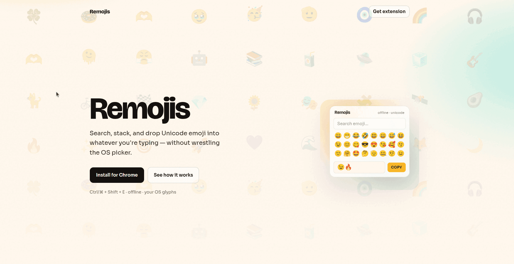

_head to https://chrome.google.com/u/1/webstore/devconsole/register to register for the webstore dev console account_

# Remojis

Search, stack, and copy Unicode emoji from a Chrome toolbar popup - without fighting the OS picker.

Remojis is a Manifest V3 Chrome extension (plus a marketing site in the same monorepo). Inspired by the *jobs* of [EmojiCopy](https://emojicopy.com/) and [JoyPixels’ keyboard](https://chromewebstore.google.com/detail/emoji-keyboard-by-joypixe/ipdjnhgkpapgippgcgkfcbpdpcgifncb), not their artwork or branding. Glyphs render with **your OS emoji font**; data comes from [emojibase-data](https://emojibase.dev/) (Emoji / Unicode 17).

## Why it exists

System emoji pickers are slow to open, weak at search, and often close after one character. Remojis stays in the toolbar: find an emoji in a couple of seconds, stack several in a compose bar, then copy and paste wherever you need.

## What it does

- **Search** by CLDR name, keywords, and shortcodes (`fire`, `:rocket:`, …)
- **Browse** Unicode categories (smileys, people, food, flags, …) plus **recents**
- **Multi-select compose bar** — click to add, clear with ×, **Copy** when ready
- **Skin-tone** default, **emoji size** S/M/L, adjustable recents count
- **Offline** — emoji dataset is bundled; no account, no cloud sync
- **Shortcut:** Ctrl+Shift+E / ⌘⇧E

If paste shows an empty box, your OS may not include that Unicode version yet.

## Privacy

Preferences (recents, size, skin tone) stay in `chrome.storage.local` on your device. See [PRIVACY.md](PRIVACY.md). The extension does not read page content.

## Monorepo

| Package | Path | Description |
| --- | --- | --- |
| `@remojis/extension` | [`apps/extension`](apps/extension) | Chrome emoji keyboard (Vite + React + CRXJS) |
| `@remojis/website` | [`apps/website`](apps/website) | One-page marketing site |

```bash
pnpm install
```

### Extension

```bash
pnpm dev              # same as pnpm dev:extension
pnpm build            # production build → apps/extension/dist
pnpm icons            # resize logo.png → extension icons + site favicon (see docs/ICONS.md)
```

For local testing: open `chrome://extensions` → Developer mode → **Load unpacked** → [`apps/extension/dist`](apps/extension/dist). Keep `pnpm dev` running for HMR.

### Install (until Chrome Web Store)

Publish is blocked on the one-time Web Store developer fee for now. Releases ship as downloadable zips:

```bash
git tag v0.1.0
git push origin v0.1.0
```

That runs [`.github/workflows/release-extension.yml`](.github/workflows/release-extension.yml), which builds the extension and attaches `remojis-extension-vX.Y.Z.zip` to a [GitHub Release](https://github.com/RashJrEdmund/remojis/releases). Users unzip it and load unpacked — see [docs/INSTALL.md](docs/INSTALL.md) or https://remojis.orashus.com/#install.

### Website

```bash
pnpm dev:website
pnpm build:website
```

### Both apps

```bash
pnpm build:all
pnpm lint
```

## Stack

- **Extension:** Vite, React, TypeScript, Tailwind CSS, [`@crxjs/vite-plugin`](https://crxjs.dev/) (MV3), `@tanstack/react-virtual`, `emojibase` / `emojibase-data`
- **Website:** Vite, React, TypeScript, Tailwind CSS

## Docs

- [docs/PLAN.md](docs/PLAN.md) — product / engineering notes  
- [docs/STORE.md](docs/STORE.md) — Chrome Web Store listing draft  
- [docs/INSTALL.md](docs/INSTALL.md) — download zip & load unpacked in Chrome  
- [docs/ICONS.md](docs/ICONS.md) — logo → icon sizes (`pnpm icons`)  
- [NOTICE](NOTICE) — third-party licenses  

## License

MIT for this project. Unicode characters are part of the Unicode Standard. Remojis does **not** ship JoyPixels or other commercial emoji artwork.
