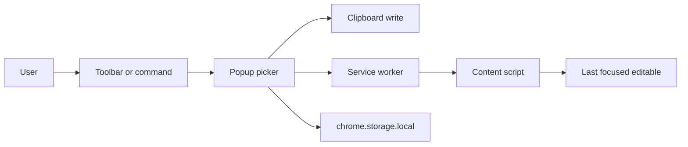

# Remojis: Emoji Chrome Extension

This is the product + engineering spec used to scaffold the repo.

**Working name:** Remojis (rename anytime before store listing).

**Stack:** Vite, React, TypeScript, Tailwind CSS, [@crxjs/vite-plugin](https://crxjs.dev/) (MV3 HMR), `emojibase-data` (Unicode 17 / Emoji 17 dataset).

**v1 click behavior:** copy to clipboard **and** insert into the last focused text field when possible.

---

## What we are building

A toolbar popup that feels like [EmojiCopy](https://emojicopy.com/) (search-first, one-click, category browse) with the keyboard-job of [JoyPixels’ Chrome extension](https://chromewebstore.google.com/detail/emoji-keyboard-by-joypixe/ipdjnhgkpapgippgcgkfcbpdpcgifncb) (insert on the current page, recents, skin tones, shortcut).

Primary job: **find an emoji in under two seconds and put it where you were typing.**

Non-goals for v1: accounts, cloud sync, custom sticker packs, shipping JoyPixels (or any third-party) emoji **artwork**, a public website, Firefox/Safari (later).

---

## Inspiration vs. original product

Take the **jobs**, not the brand, pixels, or assets.

From EmojiCopy:

- Search-first UI; click copies immediately
- Unicode groups (Smileys, People, Animals, Food, …)
- Recents; optional glyph size
- Native emoji so paste matches the OS (and empty-box honesty when the OS is behind Unicode)

From JoyPixels Keyboard:

- Insert into the focused web field, with clipboard fallback
- Keyboard nav later; diversity / skin-tone control
- Settings (recent count, size, shortcut)
- Optional later: undocked window / compose bar

Do **not** copy:

- JoyPixels sprites, PNG sets, or web fonts (commercial license)
- Their UI chrome, copy, trademarks, or extension listing text
- Pixel-perfect clones of either product

**Legal / store:** Unicode code points are fine. Render with **native fonts**. Keep a `NOTICE` for `emojibase-data` (MIT). Chrome Web Store privacy form must match permissions.

---

## Product surface (v1)

**Popup layout (top to bottom):**

- Sticky search (autofocus)
- Category tabs / icon rail (Unicode groups + Recents)
- Virtualized emoji grid
- Skin-tone control (people/body only)
- Toast: “Copied” / “Inserted” / “Copied (no text field)”
- Footer: settings (size S/M/L, recents count)

**Click pipeline:**

1. Resolve chosen glyph (base + optional skin tone / ZWJ)
2. `navigator.clipboard.writeText`
3. Ask background to insert into **last focused** editable (popup steals focus, so we cannot use `document.activeElement` on the page at click time)
4. Record recents
5. Close popup after insert (keep open on copy-only if we add a modifier later; v1 can close always)

**Editable targets:** `input` (text-like types), `textarea`, `contenteditable`. Skip password fields. Fallback: clipboard only (PDFs, `chrome://`, iframes we cannot reach).

---

## Hard problem: popup steals focus

Opening the extension unfocuses the page. v1 therefore needs a **tiny always-on content script** that:

- On `focusin`, remembers the last editable (not page text)
- On a message, inserts at that node via `execCommand('insertText')` or input/textarea `setRangeText` + `input` events so React/Vue sites update

Privacy story for the store: script does not read page content except at insert time; no analytics.

**Not v1:** Side Panel (keeps page focus; good v2). Detached `chrome.windows` popup (JoyPixels undock). Compose/multi-line copy bar.

---

## Data and search

- **Source:** `emojibase-data` English dataset + shortcodes, vendored in the extension (offline, no CDN; MV3 CSP).
- **Index at load:** character, CLDR name, keywords, GitHub/CLDR shortcodes.
- **Search:** client-side; substring + token match.
- **Skin tones:** Fitzpatrick modifiers from the dataset; persist default tone in `chrome.storage.local`.
- **Rendering:** native emoji in a grid. No image sprites in v1.

Do **not** drop in `emoji-mart` as the whole UI. Build the picker; reuse **data**, not their chrome.

---

## Chrome architecture

**Manifest V3** via CRXJS `defineManifest` (version from `package.json`).

| Piece | Role |
| --- | --- |
| Popup | React app: search, grid, settings |
| Service worker | `commands`, `runtime.onMessage` |
| Content script | last-focus tracker + insert |
| `chrome.storage.local` | recents, tone, size, recent count |

**Permissions (minimum):**

- `storage`
- Host access via content script matches: `http://*/*`, `https://*/*`

**Commands:** `Ctrl+Shift+E` / `Command+Shift+E` → `_execute_action`.

**CSP:** default extension CSP; no remote scripts; emoji JSON bundled.

---

## UX details

- Grid virtualization (`@tanstack/react-virtual`) so ~3k glyphs stay smooth
- Keyboard in v1: type to search; Enter selects first result; Esc clears / closes
- A11y: `role="grid"`, labels from CLDR names, visible focus
- Light UI first; follow `prefers-color-scheme`
- Unsupported OS glyphs: still copy; tooltip that paste may tofu

---

## Testing and release

- Manual: Gmail, Twitter/X, Notion, Google Docs, GitHub, Discord web, `contenteditable` demos, pages with no field
- iframe / shadow DOM: may fail in v1
- Store: 16/32/48/128 icons, privacy policy URL, single-purpose description

---

## Risks

- Insert reliability on heavily controlled editors (Docs, Notion) — clipboard still wins
- Broad host permission review — justify in store listing
- Popup size limits — compact chrome, virtualize grid
- Dataset updates — bump `emojibase-data` after Unicode releases
