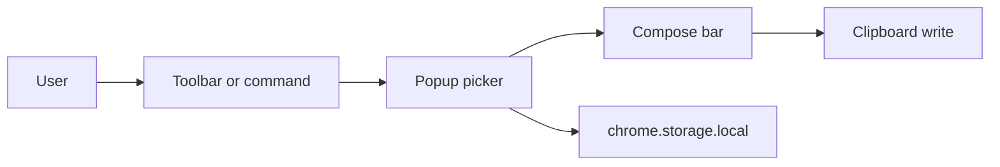

# Remojis: Emoji Chrome Extension

This is the product + engineering spec used to scaffold the repo.

**Working name:** Remojis (rename anytime before store listing).

**Stack:** Vite, React, TypeScript, Tailwind CSS, [@crxjs/vite-plugin](https://crxjs.dev/) (MV3 HMR), `emojibase-data` (Unicode 17 / Emoji 17 dataset).

**v1 click behavior:** stack emoji in a compose bar, then **copy to clipboard**. Paste with Ctrl/⌘+V.

---

## What we are building

A toolbar popup that feels like [EmojiCopy](https://emojicopy.com/) (search-first, category browse, copy) with the keyboard-job of [JoyPixels’ Chrome extension](https://chromewebstore.google.com/detail/emoji-keyboard-by-joypixe/ipdjnhgkpapgippgcgkfcbpdpcgifncb) (recents, skin tones, shortcut) — without requiring host access for v1.

Primary job: **find an emoji in under two seconds and get it onto the clipboard.**

Non-goals for v1: page insert, accounts, cloud sync, custom sticker packs, shipping JoyPixels (or any third-party) emoji **artwork**, Firefox/Safari (later).

---

## Inspiration vs. original product

Take the **jobs**, not the brand, pixels, or assets.

From EmojiCopy:

- Search-first UI; compose then copy
- Unicode groups (Smileys, People, Animals, Food, …)
- Recents; optional glyph size
- Native emoji so paste matches the OS (and empty-box honesty when the OS is behind Unicode)

From JoyPixels Keyboard:

- Keyboard nav later; diversity / skin-tone control
- Settings (recent count, size, shortcut)
- Compose / multi-select bar (shipped in v1)
- Optional later: insert into the focused web field; undocked window

Do **not** copy:

- JoyPixels sprites, PNG sets, or web fonts (commercial license)
- Their UI chrome, copy, trademarks, or extension listing text
- Pixel-perfect clones of either product

**Legal / store:** Unicode code points are fine. Render with **native fonts**. Keep a `NOTICE` for `emojibase-data` (MIT). Chrome Web Store privacy form must match permissions.

---

## Product surface (v1)

**Popup layout (top to bottom):**

- Sticky search (autofocus)
- Category tabs / icon rail (Unicode groups + Recents)
- Virtualized emoji grid
- Skin-tone control (people/body only)
- Settings (size S/M/L, recents count)
- Compose bar + Copy; toast: “Copied”

**Click pipeline:**

1. Resolve chosen glyph (base + optional skin tone / ZWJ)
2. Append to compose selection; record recents
3. On Copy: `navigator.clipboard.writeText`
4. Toast “Copied”, then close popup

---

## Future improvement: page insert

Clipboard-only keeps the extension simple: no content script, no host permissions, no focus races. Insert into the last focused field is a **v2 candidate** if we want one-tap paste without Ctrl/⌘+V.

**Why it is hard:** opening the popup unfocuses the page, so `document.activeElement` on the page is useless at click time. Insert would need a **tiny always-on content script** that:

- On `focusin`, remembers the last editable (not page text)
- On a message, inserts at that node via `execCommand('insertText')` or input/textarea `setRangeText` + `input` events so React/Vue sites update

**Editable targets (when built):** `input` (text-like types), `textarea`, `contenteditable`. Skip password fields. Fallback: clipboard only (PDFs, `chrome://`, iframes we cannot reach).

**Privacy / store:** script must not read or transmit page content except at insert time; justify `http://*/*` / `https://*/*` host access in the listing.

**Also later:** Side Panel (keeps page focus); detached `chrome.windows` popup (JoyPixels undock).

---

## Data and search

- **Source:** `emojibase-data` English dataset + shortcodes, vendored in the extension (offline, no CDN; MV3 CSP).
- **Index at load:** character, CLDR name, keywords, GitHub/CLDR shortcodes.
- **Search:** client-side; substring + token match.
- **Skin tones:** Fitzpatrick modifiers from the dataset; persist default tone in `chrome.storage.local`.
- **Rendering:** native emoji in a grid. No image sprites in v1.

Do **not** drop in `emoji-mart` as the whole UI. Build the picker; reuse **data**, not their chrome.

---

## Chrome architecture

**Manifest V3** via CRXJS `defineManifest` (version from `package.json`).

| Piece | Role |
| --- | --- |
| Popup | React app: search, grid, compose, settings |
| `chrome.storage.local` | recents, tone, size, recent count |

**Permissions (minimum):**

- `storage`

**Commands:** `Ctrl+Shift+E` / `Command+Shift+E` → `_execute_action`.

**CSP:** default extension CSP; no remote scripts; emoji JSON bundled.

*(Service worker + content script return if/when page insert ships.)*

---

## UX details

- Grid virtualization (`@tanstack/react-virtual`) so ~3k glyphs stay smooth
- Keyboard in v1: type to search; Enter selects first result; Esc clears / closes; Enter in compose submits Copy
- A11y: `role="grid"`, labels from CLDR names, visible focus
- Light UI first; follow `prefers-color-scheme`
- Unsupported OS glyphs: still copy; tooltip that paste may tofu

---

## Testing and release

- Manual: copy + paste into Gmail, Twitter/X, Notion, Google Docs, GitHub, Discord web
- Store: 16/32/48/128 icons, privacy policy URL, single-purpose description

---

## Risks

- Page insert (future): reliability on heavily controlled editors (Docs, Notion); broad host permission review
- Popup size limits — compact chrome, virtualize grid
- Dataset updates — bump `emojibase-data` after Unicode releases
